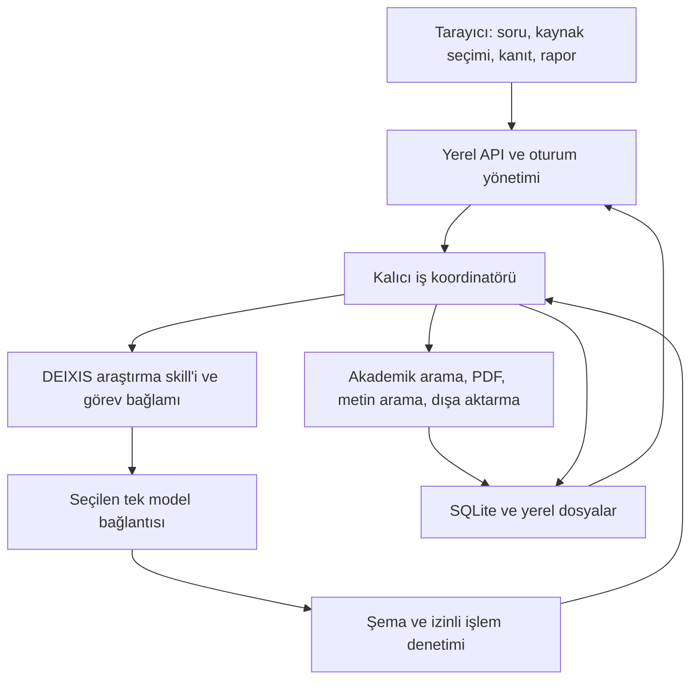

# DEIXIS — çalışma mekanizması, skill ve uygulama planı

**Tarih:** 14 Eylül 2026. **Sürüm:** taslak 2. **Durum:** taslak 1, Claude Fable 5.1 / High tarafından `ready_with_changes` olarak değerlendirildi; bulgu disposition'u ve düzeltmeler tamamlandı. [Denetim kaydı](plan-review-2026-09-14.md) incelenen hash'i, bütün bulguları ve sınırları içerir. Taslak 2 yeniden Fable denetimine gönderilmedi; uygulama henüz kurulmadı.

Bu belge, DEIXIS'i mevcut arayüz prototipinden günlük kullanılabilir yerel araştırma uygulamasına taşıyacak ana uygulama planıdır. Kullanıcının bu görüşmedeki sırası: **kapsamlı plan → istenen modelle denetim → bulguların değerlendirilmesi → uygulama**. Bu dosyanın yazılması skill'in, backend'in veya araştırma yönteminin çalıştığını göstermez.

## 1. Yetki, mevcut durum ve hedef

Önceden kabul edilmiş ürün kararlarının ayrıntılı kaydı [tarihli devir belgesidir](../desktop/README.md); kısa harita [ürün özetidir](README.md). Bu plan kabul edilmiş ihtiyaçları korur ve açık teknik seçimlere **önerilen varsayılanlar** getirir. [API/veri taslağı](api-and-data.md), [yöntem incelemesi](../methods/research-methods.md) ve [ilk çalışma dilimi](first-slice-plan.md) dayanak belgelerdir. Çelişki halinde kullanıcı kararı teknik öneriden üstündür; eski bir taslak cümlesi yeni bir onay şartı oluşturmaz.

| Mevcut parça | Doğrulanan durum | Plandaki karşılığı |
|---|---|---|
| `apps/web/` (eski `prototypes/shadcn-ui/` kopyasından başladı; prototip [D10](../decisions.md) ile silindi) | React, TypeScript, Vite, Tailwind ve shadcn bileşenleri | Etkileşim ve görsel temel; gerçek veri servisine aşamalı geçiş |
| Ayrı Quaestio deposu | `SKILL.md`, yöntem referansları ve önceki değerlendirme kayıtları var | Yöntem kaynağı; DEIXIS'e bağlanmış çalışma zamanı bağımlılığı değil |
| DEIXIS araştırma skill'i | Henüz yok | P1'de hazırlanacak ve sürümlenecek |
| DEIXIS backend, veritabanı, akademik bağlantılar | Henüz yok | P2–P4'te dar çalışan dilim |
| Codex / Claude erişimi | Devir kaydında ayrı yerel denemeler var; bu turda Claude Code 2.1.270, Codex CLI 0.154.0 gözlendi | Uygulama adaptörü, araç sınırları ve yeniden başlatma desteği ayrıca sınanacak |
| Canlı araştırma doğruluğu | DEIXIS üzerinden ölçülmedi | P4'ten sonra bilinen kaynaklarla değerlendirme |

**İlk kullanılabilir sonuç:** kullanıcı doğal dilde soru sorar; seçtiği akademik kaynaktan yayınlar bulunur; seçim ve erişim durumlarını görür; incelenmiş pasajlara bağlı yanıt alır; atfa tıklayıp dayanağı açar; uygulamayı yeniden başlattığında çalışmasına devam eder. PDF eklemek isteğe bağlıdır.

**Ürün hedefi:** bu temel üzerine düzenlenebilir kanıt tablosu, rapor, CoI sentezi, aday araştırma soruları, iddiaya özgü kill-search, isteğe bağlı başka modelle inceleme ve yeni yayın takibi eklenir. İlk dar dilim ile bütün web ürününün tamamlanması ayrı kilometre taşlarıdır.

## 2. Korunan ürün kararları

- Önce tek kullanıcılı **yerel web uygulaması**: tarayıcı, yerel backend ve kullanıcının bilgisayarında veri. Daha sonra aynı ürünün macOS/Windows için Tauri paketlemesi. Kamuya açık çok kullanıcılı SaaS bu planın ilk sürümü değildir.
- Tek ana araştırma ajanı; keşif, sentez, aday geliştirme ve kill-search ayrı ajanlar değil, ihtiyaca bağlı sorumluluklardır. Başka modelle inceleme kullanıcı tarafından ayrıca başlatılır. İstisna ([D14](../decisions.md)): arama planı ve tarama ayrıca seçilen literatür modeliyle çalışır; cevap tamamlanınca ayarlanmış incelemeci model iddiaları arka planda inceler. Adımlar yine sırayla çalışır.
- Uygulama alan bağımsızdır. Moleküler haberleşme, OR/MILP, algae ve UWSN örnektir; sabit ürün ontolojisi değildir.
- Akademik kapsam Semantic Scholar, Crossref, arXiv, OpenAlex, Scopus, IEEE Xplore ve SerpApi'yi içerir. Uygulama sırası, sağlayıcıları kapsamdan çıkarmak anlamına gelmez. Her soruda hepsi aranmaz.
- Model bağlantısı ile kaynak kapsamı ayrı seçilir. Bağlantı önceliği Codex, ardından Claude hesabı, sonra DeepSeek API'dir; Ollama isteğe bağlıdır. Kullanıcının modeli korunur; başarısızlıkta sessiz değişim yapılmaz.
- Ortak kütüphane altında ayrı araştırmalar ve sohbetler bulunur. RAG yalnız aktif araştırmanın kaynaklarında, gerekiyorsa daha dar sohbet seçiminde çalışır.
- Arayüz varsayılan İngilizce, Türkçe destekli; yanıt varsayılan sorunun dilinde, rapor dili bağımsızdır. Açık/koyu tema ve kalıcı tercih korunur.
- Kaynak seçimi, rapor metni, kanıt hücreleri ve kişisel notlardaki kullanıcı düzenlemeleri sonraki model çıktısıyla ezilmez.
- Bağlam sınırı, sağlayıcı kotası ve çalışma bütçesi ayrı izlenir. Bilinmeyen değer bilinmiyor olarak gösterilir. İş kaydedilir; maliyet/kapsam sınırında veya bağlantı hatasında duraklar.
- Rapor Markdown/PDF, tablo CSV/Excel, kaynakça BibTeX/RIS olarak dışa aktarılır. Tam proje paketiyle bilgisayarlar arası taşıma daha sonraki aşamadır.
- Yeni yayın kontrolü varsayılan elle, isteğe bağlı araştırma bazında haftalık/aylıktır. Bu tasarım mevcut hesapta bir otomasyon kurmaz.

## 3. Çalışma mekanizması

### 3.1 Katmanlar ve tek sorumluluk



**Skill:** modelin hangi soruyu soracağını, hangi kaynakları karşılaştıracağını, neyi iddia edebileceğini ve belirsizliği nasıl ifade edeceğini belirler. **Koordinatör:** izinli işlemleri, durum geçişlerini, sınırları ve kalıcı kayıtları yürütür. **Model:** yorum ve işlem önerisi üretir. **Araştırmacı:** amaç, bilimsel değer, önemli kapsam değişimi ve deney kararlarını verir.

Modelin JSON üretmesi doğruluk garantisi değildir. Kod, kimlikleri ve kaynak konumlarını denetleyebilir; pasajın iddiayı gerçekten desteklediği ayrıca semantik inceleme gerektirir. İkinci modelin katılması bilimsel doğrulama değildir.

### 3.2 Soruya göre yöntem seçimi

| İstek | Gerekli akış | Koşullu ek akış |
|---|---|---|
| Bir konuda açıklama / kaynaklı soru-cevap | Kapsam → arama/seçili kaynak → pasaj inceleme → kaynaklı yanıt | Gerekirse karşılaştırma tablosu |
| Eldeki makaleleri karşılaştırma | Seçili corpus → karşılaştırma boyutları → hücre/pasaj eşleme | Kullanıcı isterse yeni literatür arama |
| Tek makale / belirli iddiayı kontrol | Kaynak sürümü → ilgili bölüm → koşullar ve kanıt sınırı | Kritik denklem/tablo için orijinal sayfaya dönüş |
| Alanı öğrenme / araştırma sorusu geliştirme | Keşif → kavram ve CoI sentezi → kullanıcı yönlendirmesi → aday kartı | Her özgünlük iddiası için ayrı kill-search |
| Mevcut fikrin literatürdeki yerini sorgulama | İddiaları ayır → yakın çalışmalar → iddia/pasaj karşılaştırması | Kalan anlamlı iddia için aday revizyonu |
| Related work / rapor | Seçilmiş kanıt → izlenebilir metin → düzenlenebilir rapor | Kullanıcı seçerse ek arama veya model incelemesi |
| Araştırma tasarımı | Amaç, karşılaştırıcı, varsayım, ölçüm ve yanlışlama koşulu | Deney yürütme ayrıca kapsam ve kaynak kararı ister |

Her soruya aday üretimi veya kill-search zorlanmaz. Açık soruda işe başlanır; cevabı değiştirecek belirsizlikte kısa soru sorulur. Ön eleme gerekçeleri görünür/düzenlenebilir olur; her yayın için onay gerekmez. Sistematik derleme modunda kullanıcı onaylı eleme seçilebilir.

### 3.3 Normal araştırma çevrimi

1. **Kaydet ve kapsamla.** Soru, araştırma/sohbet kimliği, corpus seçimi, model, dil, derinlik ve bütçe kaydedilir. Soru metni talimattır; PDF/arama sonucundaki metin veri olarak tutulur.
2. **Arama planını oluştur.** Skill kavram/sinonim/yakın alan sorguları önerir; backend sağlayıcıya özgü sorguyu ve çağrı sınırını denetler. İlk prototipte arama modülüne gerekli girdiler yapılandırılmış model çıktısından gelir.
3. **Bul, tekilleştir ve seç.** Ham sağlayıcı kaydı, sorgu, tarih, hata ve sayfalama sınırı korunur. Aynı yayın ailesi farklı sürümlerle bağlanır. Kullanıcının seçimi otomatik ön elemeden üstündür.
4. **Eriş ve incele.** Tam metin erişimi ayrıca kontrol edilir; PDF yoksa özetle çalışılabilir. İndirme, metin çıkarma, OCR ve gerçekten incelenen bölüm ayrı durumdur. Erişilemeyen kayıt silinmez.
5. **Çıktıyı üret ve denetle.** Model yalnız sağlanan kaynak/pasaj kimliklerine bağlanan iddialar önerir. Backend kapsam, sürüm ve konum bütünlüğünü denetler. Kopuk atıflı çıktı kanıtlı sonuç olarak yayımlanmaz; taslak ve hata korunur.
6. **Göster ve devam ettir.** Yanıt, kaynaklar ve erişim sınırları gösterilir. Bir durum kartı aynı yerde güncellenir; bulunan, benzersiz, seçilen, incelenen ve atıf yapılan yayın sayıları ayrı hesaplanır.
7. **Gerekli yönteme devam et.** Sentez/aday/kill-search gerekiyorsa mevcut kanıt yeniden kullanılır. Sonlu kapsam ve bütçe içinde yeni kanıt aranabilir; aksi halde kalan belirsizlikle durulur.

CoI gelişim bağları kronolojik sıralamadan veya atıftan otomatik çıkarılmaz. Her bağda kaynak desteği veya açık analist çıkarımı bulunur. Aday, amaç–mekanizma–değerlendirme, yakın karşılaştırıcı, varsayım ve yanlışlama koşulunu taşır. Kill-search sonucu iddia/sürüm bazındadır; aramada eşleşme bulunmaması özgünlük belgesi değildir.

### 3.4 Durum, kesinti ve yeniden başlatma

`Run.status`: `queued`, `running`, `pause_requested`, `paused`, `completed`, `failed`, `cancelled`. `Run.stage` bundan ayrıdır: intake, discovery, screening, inspection, answer, synthesis, candidate, claim_check, export. `RunStep.status`: `pending`, `running`, `succeeded`, `partial`, `failed`, `cancelled`, `outcome_unknown`.

- İlk sürümde bir etkin araştırma çalışması yürür; diğerleri kalıcı sırada bekler. Tek model işlemi aynı anda çalışır. Bu başlangıç kapasite tercihidir; çok kullanıcı ölçeklenebilirliği iddiası değildir.
- Her dış işlemden **önce** işlem kimliği, girdi özeti/hash'i ve ayrılan bütçe kaydedilir. Sonuç, kaynak kayıtları ve tamamlanma olayı aynı veritabanı işleminde bağlanır; UI yalnız commit edilmiş olayları alır.
- SQLite tabanlı iş kaydı ve süreç ömrünce tutulan OS advisory lock ile tek sahipli worker kullanılır. İkinci uygulama örneği kilidi alamazsa yeni worker başlatmaz. Sahip kaydında instance UUID, PID ve süreç başlangıç zamanı bulunur; PID veya heartbeat yaşı tek başına canlı işin kilidini silmek için yeterli değildir. Yeniden açılışta OS kilidi alındıktan sonra önceki instance'ın yarım adımları kurtarılır. API isteğinin arka plan callback'i tek başına iş kuyruğu değildir. OCR gibi CPU işleri ayrı sınırlı süreçte çalıştırılır.
- Tarayıcı kapandığında backend sürüyorsa iş devam eder. Backend kapanınca mevcut adımlar korunur; yeniden açılışta yarım adım `outcome_unknown`/`paused` olarak ele alınır ve devam seçeneği gösterilir.
- Dış sağlayıcı için exactly-once yürütme varsayılmaz. Yanıt alınmadan kopan ücretli çağrı otomatik tekrarlanmaz; varsa sağlayıcı işlem kimliğiyle uzlaştırılır, yoksa olası tekrar maliyeti görünür kılınır.
- Kullanıcı yönlendirmesi soru/kapsamın yeni sürümünü oluşturur. Eski sürümle başlayan sonuç saklanır fakat yeni kapsamın geçerli sonucu olarak otomatik uygulanmaz. Kritik kapsam/model değişimi devam eden çağrının bitiş sınırında uygulanır.
- Duraklatma yeni çağrıları engeller. Adaptör iptali destekliyorsa çağrı iptal edilir; desteklemiyorsa “mevcut çağrı tamamlanınca duracak” gösterilir. İptal ücret iadesi anlamına gelmez.
- Bağlam devrinde ham kaynaklar, görev durumu, insan düzeltmeleri, iddia/pasaj kimlikleri ve açık işler kalıcı kayıttadır. Özet yardımcıdır; önceki model oturumu tek veri kaynağı değildir.
- Her model adımı için geri okunabilir, değişmez bir `StepInput` kaydı tutulur: tam modele verilen mesaj/çıktı şeması, skill hash'i, kapsam sürümü ve verilen kaynak/pasaj kimliklerinin izin listesi. Metinler yerel özel kütüphanede saklanır; sırlar girdiye alınmaz. Yalnız hash tutmak girdiyi yeniden kurmaya yetmez.
- P2–P4'te her model adımı yeni bir model oturumu/thread'iyle başlar; `ModelSession` kaydı research/run/step kimliklerine bağlıdır. Başka araştırmanın oturumu yeniden kullanılmaz. Daha sonra aynı run içinde oturum sürdürme eklenirse kapsam daralmasında yeni oturum zorunludur. Her çıktıdaki kaynak kimlikleri yalnız o adımın `StepInput` izin listesine karşı denetlenir; ortak kütüphanede mevcut olması yeterli değildir.

## 4. Skill yazım planı

### 4.1 Önerilen karar

**DEIXIS içinde yüklenen tek `deixis-research` skill paketi** yazılması önerilir. Kullanıcı skill seçmez; uygulama görevle ilgili talimatı yükler. Ayrı genel amaçlı skill dağıtımı veya global kurulum ilk ürünün şartı değildir. Önceki “ayrı skill yazmayalım” tavsiyesi kabul edilmiş kullanıcı kararı değildi; bu öneri kullanıcının şimdi istediği skill çalışmasını somutlaştırır.

Quaestio'yu bütünüyle kopyalayıp iki canlı yöntem ağacı tutmak yerine gereken kurallar, **sabit kaynak revizyonu ve dosya hash'leriyle** uyarlanır. Başlangıç kaynağı olarak yerelde gözlenen Quaestio `037972d5add41d8a62cff45e09785beebc61bb01` yeniden doğrulanır. Sibling checkout veya kullanıcının global skill klasörü dağıtılan uygulamanın çalışma zamanı gereksinimi olmaz.

DEIXIS'in yüklediği paket kendi yöntem sürümünün tek çalışma zamanı kaynağıdır. Quaestio güncellemeleri otomatik alınmaz; fark, kaynak/provenance ve davranış testleriyle değerlendirilir. Aktarılan içerik için dağıtım/lisans uygunluğu kamuya dağıtımdan önce incelenir; bu iç geliştirmeyi durdurmak için genel bir onay şartı değildir.

### 4.2 Planlanan içerik ve yerleşim

Bu yollar P1 ve ilgili sonraki aşamalar için öneridir; bu plan yazılırken oluşturulmuş değildir.

```text
methods/deixis-research/
  SKILL.md                       amaç, görev seçimi, ortak kanıt kuralları
  references/
    source-grounded-answer.md    arama, seçim, okuma ve kaynaklı yanıt
    synthesis.md                 CoI ve karşılaştırma; P6
    candidate-check.md           aday ve iddiaya özgü kill-search; P6
  provenance.json                Quaestio revizyonu, dosyalar, uyarlama kaydı
```

P1 yalnız giriş talimatı, kaynaklı yanıt referansı ve provenance ile başlar; sonraki modüller uygulandıkları aşamada eklenir. `SKILL.md` çalışmayan araçları veya henüz desteklenmeyen görevleri mevcut özellik olarak sunmaz. Görev girdisi desteklenen yetenekler, kapsam ve çıktı şemasını ayrıca içerir.

Skill metni kısa İngilizce çalışma talimatı olabilir; kullanıcı yanıt dili bağımsızdır. Alan örnekleri yöntemi tek alana kilitlemez. Kullanılmayan yöntem dosyaları her çağrıya eklenmez. Programatik yükleme ile aynı paket test edilir; ayrı “uygulama prompt'u” kopyası oluşturulmaz.

### 4.3 Girdi/çıktı sözleşmesi

**Girdi:** görev türü; kullanıcının tam sorusu ve son yönlendirmesi; `scope_revision`; kaynak/korpus kimlikleri; yetenek listesi; erişilebilir pasajlar ve okuma düzeyleri; geçerli model; bütçe; istenen çıktı JSON şeması; insan düzeltmeleri ve açık işler.

**Çıktı:** işlem önerisi veya sonuç taslağı; iddia kimlikleri; yalnız verilen pasaj kimlikleri; destek/çıkarım ayrımı; belirsizlik ve erişim sınırı; gerektiğinde hedefli açıklama sorusu. Model DB kimliği, PDF sayfası veya yapılmış işlem icat edemez. Yeni kimlikleri backend tahsis eder; model geçici etiketleri backend'e eşletir.

Şemanın asıl sahibi kod sözleşmeleridir; skill'e gerekli şema çalışma anında verilir. Her çalışmada skill paket hash'i, şema sürümü ve model kimliği kaydedilir. Model çıktısının şema onarımı en fazla bir ek denemedir; başarısızsa sonuç doğrulanmamış taslak olarak kalır. Sırf “başarılı yanıt” elde etmek için sınırsız yeniden üretim yapılmaz.

P1'in kanonik sözleşmeleri `contracts/research/` altında dil bağımsız JSON Schema dosyalarıdır. Minimum çıktı türleri:

| Şema | Adım ve zorunlu içerik |
|---|---|
| `SearchPlan` | Kavram/sorgu önerileri, seçili sağlayıcı kimlikleri, arama gerekçesi ve kapsam sınırı |
| `ScreeningProposal` | Verilmiş aday kimlikleri, include/exclude/uncertain önerisi ve gerekçe; kullanıcı seçimini ezme yetkisi yok |
| `GroundedAnswerDraft` | Yerel iddia etiketleri, yanıt metni, verilen passage kimlikleri, destek/çıkarım etiketi ve erişim/belirsizlik sınırları |
| `ClarificationRequest` | Cevabı etkileyen tek belirsizlik, kısa soru ve ilgili kapsam; yalnız gerekli durumda |

Ortak zarf `schema_version`, `step_input_id`, `scope_revision` ve `skill_package_hash` içerir. Beklenen değerleri backend üretir; modelin geri gönderdiği değerler yetki kaynağı sayılmaz ve uyuşmazsa çıktı reddedilir. Pydantic/TypeScript uyarlamaları P2'de bu şemalara karşı doğrulanır; OpenAPI'den UI tip üretimi aynı sözleşmeleri korur.

### 4.4 Skill doğrulaması

- Paket/frontmatter ve referans bütünlüğü kontrol edilir; bunun davranışsal etkinlik göstermediği yazılır.
- P1'de sentetik kaynaklar ve sahte model çıktılarıyla şema, verilen kimlik kümesi, sürüm ilişkisi ve revision-conflict kuralları modelsiz sınanır. Bunlar veri sözleşmesi testleridir; skill'in model davranışını değiştirdiğini göstermez.
- Özet-only, yanıltıcı “optimization” sözcüğü, kaynak içi talimat ve kullanıcı düzeltmesi için gerçek model davranış vakaları P1'de hazırlanır, P2 adaptörü hazır olunca aynı skill paketiyle yürütülür. Sonraki canlı UI testleri ayrı raporlanır.
- Desteklenen sıradan soru-cevap isteğinin gereksiz aday/kill-search başlatmadığı P2'de gerçek modelle kontrol edilir. P1–P4'te discovery/sentez/aday modları henüz uygulanmadığı için sıradan yanıt gibi başarıyla tamamlanmış gösterilmez; kullanıcıya yetenek sınırı gösterilir. Bu modların doğru davranışı P6'da sınanır.
- Prompt beklenen cevabı açıkça söyleyen geliştirme örnekleri ile daha sonra seçilecek tutulmuş değerlendirme örnekleri ayrılır. Başka modelin plan denetimi bu testlerin yerine geçmez.

## 5. Teknik mimari önerisi

| Bileşen | Önerilen başlangıç | Gerekçe ve sınır |
|---|---|---|
| Frontend | Mevcut React + TypeScript + Vite + Tailwind/shadcn temeli | Prototip yatırımı korunur; sentetik veri üretim veri katmanından ayrılır |
| Backend | Python + FastAPI + Pydantic; HTTPX ile sağlayıcı istemcileri | Araştırma/PDF ekosistemiyle uyum; TypeScript/Python sözleşme uyumu ayrıca sağlanır |
| Veri | SQLite, açık migration dosyaları, foreign key denetimi; içerik dosyaları ayrı | Tek kullanıcı için az işletim yükü; dağıtık veya çok makineli DB tasarımı değil |
| İş yürütme | SQLite iş/adım günlüğü + tek yerel worker; sınırlı alt süreçler | Duraklama/yeniden açılma gözlenebilir; Redis/Celery ilk kurulumun şartı olmaz |
| UI ilerlemesi | REST komutları, kalıcı sıra numaralı olaylar ve SSE akışı | Bağlantı koparsa `after_event_id` ile yeniden okuma; WebSocket ilk dilimde gerekmiyor |
| İlk model | Desteklenen Codex App Server bağlantısı | Ayrı P2 adaptör denemesiyle sınırları doğrulanacak |
| İlk akademik arama | OpenAlex; kullanıcı etkinleştirirse | Alan bağımsız başlangıç önerisi; erişim modu/kota doğrulanmadan hazır gösterilmez |
| Metin ve PDF | İlk dilimde pypdf ile sayfa bazlı çıkarım, tarayıcıda PDF.js adayı | Karmaşık matematik ve taramalar için yeterlilik iddiası yok; orijinal sayfa korunur |
| OCR | P5'te yerel OCR worker; Tesseract tabanlı araç için bağımlılık/kalite denemesi | İngilizce/Türkçe taranmış örneklerle sınanır; OCR yoksa inceleme limiti görünür |
| Retrieval | İlk dilimde SQLite FTS5 + bölüm/sayfa okuma | Embedding gerektirmeden çalışır; semantik retrieval üstünlüğü iddia edilmez |
| Vektör arama | Ölçülen gereksinim varsa Chroma + ayrı embedding adaptörü | Opsiyonel; model, boyut, chunk sürümü ve yeniden indeksleme sözleşmesi gerekir |
| Paketleme | Yerel başlatıcı; sonrasında Tauri + paketli backend | macOS/Windows süreç, izin, kurulum ve yükseltme testleri ayrı |

Python backend iki dilin sürüm/sözleşme bakımını ve masaüstü paketleme yükünü artırır; burada tercih araştırma araçlarının entegrasyon maliyetiyle dengelenir. P2'de başarısız olan temel paketleme/uyumluluk denemesi yeniden karar gerekçesidir. LangChain ilk bağımlılık değildir; somut bir bileşeni sadeleştirirse ve provenance kaybolmazsa eklenebilir. Bunlar benchmark sonucu değil, teknik tasarım önerileridir.

FastAPI belgeleri istek sonrası görevleri açıklarken ağır işler için ayrı işlem araçlarını tartışır; kalıcılık garantisini biz kuracağız ([belge](https://fastapi.tiangolo.com/tutorial/background-tasks/)). SQLite FTS5 bir metin arama bileşenidir ([belge](https://www.sqlite.org/fts5.html)); seçilen Python dağıtımında etkinliği P2'de doğrulanır.

pypdf metin çıkarımı taranmış görüntüye OCR uygulamaz; karmaşık konum ve matematik çıkarımı ayrıca denetlenmelidir ([metin çıkarımı](https://pypdf.readthedocs.io/en/stable/user/extract-text.html)). PDF.js'in sayfa görüntüleme API'si kaynak paneline temel olabilir; sayfanın açılması semantik destek kontrolü değildir ([örnekler](https://mozilla.github.io/pdf.js/examples/)). Bu teknik bağlantılar 14 Eylül 2026'da incelendi; paket sürümleri P2'de ayrıca kilitlenecektir.

### 5.1 Kod yerleşimi ve geliştirme ortamı

Uygulama başladığında `apps/web/`, `backend/deixis/`, `contracts/research/`, `methods/deixis-research/` ve `tests/` oluşturulur. Backend içindeki `domain`, `workflow`, `providers`, `models`, `documents`, `storage` sınırları modül seviyesindedir; ayrı servisler değildir. Prototipten taşınacak UI ilk testler sırasında kopyalanıp dar kapsamda uyarlanır; mevcut demo referansı korunur. Sahte yanıt işleyicileri canlı yolda kalmaz.

P2'de desteklenen Python/Node sürümleri seçilip kilitlenir; kurulum dosyaları ve kilit dosyaları repoya girer. Şu anki makinede kurulu sürüm tek başına ürün minimumu sayılmaz. P1 JSON Schema dosyaları dil bağımsız kalır; backend modelleri bunlara karşı test edilir. UI tipleri uyumlu API/OpenAPI şemasından üretilir ve sözleşme değişimi test edilir. Servis derlenmiş UI'yi aynı origin'den sunar; geliştirme Vite proxy'si bu sınırı bozmaz.

Başlatıcı API/worker'ı başlatır, hazır olmasını bekler, tarayıcıyı açar ve port çakışmasını anlaşılır gösterir. Backend ömrü tarayıcı sekmesine bağlı değildir; kapatma işlemi worker durumunu kalıcılaştırıp alt süreçleri temizler. Kurulum ve çalıştırma komutları P2'de gerçek dosyalarla doğrulanarak eklenir; burada çalışmayan komutlar hazır talimat diye verilmez.

### 5.2 Model bağlantıları

Ortak adaptör: `discover`, `capabilities`, `run`, `cancel`, `usage`, `health`. Kurulu, oturum açık, model listesi alınabilir ve seçilen işlem kullanılabilir durumları ayrı tutulur. Sağlayıcının bildirmediği yetenek/kota `unknown` olur.

İlk bağlantı Codex App Server üzerinden `initialize`, model keşfi, görev/turn başlatma ve çıktı olaylarının uygulama sözleşmesine çevrilmesidir. Şema kurulu CLI sürümünden üretilir; desteklenmeyen alanlar tahmin edilmez. App Server, model listesi ve yapılandırılmış turn çıktısını belgeler; dinamik araç akışı deneysel olarak işaretlidir ([resmî belge](https://developers.openai.com/codex/app-server/)). İlk dilim deneysel dinamik araçlara zorunlu bağımlılık kurmadan, backend'in yürüttüğü sınırlı işlemler ve yapılandırılmış model yanıtlarıyla tasarlanır.

**P2 zorunlu denemesi:** global skill, MCP, shell, ağ ve dosya araçlarının araştırma kapsamını aşamadığını doğrula. Oturumun yalnız kendi görev verisine eriştiği, modelin backend dışından arama/harcama/DB yazması yapamadığı gözlenebilir olmalı. “Salt okunur prompt” yeterli değildir; desteklenen yapılandırma ve süreç izinleriyle sınır uygulanamıyorsa adaptör hazır sayılmaz. Alternatif bağlantıya geçiş kullanıcı model seçimini değiştirmeden yapılamaz.

Bu deneme P2'nin ilk işidir; bütün backend'in bitmesini beklemez. Başarısız olursa modelden bağımsız depolama/arama işleri devam edebilir, fakat P4'ün canlı yanıt çıkış koşulu geçmez. Kullanıcı Claude programatik adaptörünü veya yenilenmiş anahtarla DeepSeek adaptörünü öne almayı seçebilir; seçerse ilgili P7 adaptör işi P4 öncesine taşınır. Aynı kapsam/bütçe/araç sınırları alternatifte de sınanır. Kullanıcı adına bağlantı değişimi yapılmaz.

Claude bağlantısı sonraki aşamada kendi desteklenen programatik arayüzüyle kurulur. Bu planın harici Claude denetimi DEIXIS Claude adaptörünün uygulandığı anlamına gelmez. DeepSeek önceden konuşmada açığa çıkan anahtar yerine kullanıcının yenilediği yerel anahtarla yapılandırılır. Uygulama agent hesabının token'ını çıkarıp genel model API'sinde kullanmaz.

### 5.3 Akademik sağlayıcılar

Bağlantı sözleşmesi: arama, tekil kayıt, sayfalama/cursor, normalize kayıt, kaynak/erişim linkleri, isteğe bağlı atıf/fulltext yeteneği, hata ve limit bilgisi. Yeni veritabanı eklemek adapter veya desteklenen deklaratif eşleme ister; yalnız URL/anahtar bütün protokolleri tanımlamaz.

Önerilen sıra: P3 OpenAlex; P5 Crossref/arXiv ve Semantic Scholar; P7 IEEE Xplore/Scopus, SerpApi ve ek bağlantı sözleşmesi. Sıra gerçek erişim ve kullanıcı ihtiyacına göre değişebilir; her bağlantı ayrı test matrisiyle hazır olur. OpenAlex güncel belgesi anahtarsız sınırlı temel sorgular ile anahtarlı kullanımı ayırır; uygulama fiilî erişim modunu ve sağlayıcının limitlerini kaydeder, eski kota sayılarını sabitlemez ([kimlik doğrulama](https://help.openalex.org/api/authentication/)).

Her çağrıda seçili provider, tam sorgunun sır içermeyen hali, tarih, cursor, limit ve yanıt/hata korunur. `zero_results`, `auth_required`, `entitlement_missing`, `rate_limited`, `timeout`, `parse_error` ve `partial` ayrıdır. Rate-limit yanıtında sağlayıcı bekleme bilgisi gözetilir; sınırlı yeniden deneme bütçeye dahildir. Supplementary SerpApi sessiz yedek değildir.

Retry kararı hatanın adı yanında teslim durumuna bağlıdır: `before_send` (gönderilmediği doğrulanan), `rejected_not_executed` (sağlayıcının işlemediğini belirten kesin yanıt), `after_send_unknown` (işlenip işlenmediği bilinmeyen). Sınıf adım kaydında saklanır. İlk sınıf geçici hataysa sınırlı retry yapılabilir; ikinci sınıfta yalnız provider sözleşmesinin izin verdiği durumlar, örneğin uygun 429 beklemesi, retry edilebilir. Auth/entitlement değişmeden yeniden denenmez. Son sınıfta ücretli veya başka yan etkili işlem otomatik yinelenmez; timeout tek başına `before_send` kanıtı değildir.

## 6. Veri ve kanıt sözleşmesi

### 6.1 Kalıcı varlıklar

| Varlık | Kimlik ve kritik ilişkiler |
|---|---|
| Research / Conversation / Message | Ayrı kimlikler, soru/kapsam sürümü, dil, seçili bağlantı, zaman |
| Work / SourceVersion / SourceAsset | Yayın ailesi, bibliyografik sürüm, dosya SHA-256 ve alınan URL/tarih; DOI tek başına dosya sürümü değildir |
| CorpusMembership / Selection | Araştırma–yayın/sürüm ilişkisi, seçim gerekçesi, kullanıcı override'ı |
| SearchRun / SearchPage | Sorgu/provider, pagination, kısmi sonuç, provenance ve erişim limiti |
| Passage | SourceVersion + extraction sürümü, fiziksel PDF sayfası/printed label veya abstract/section konumu, metin hash'i |
| Claim / EvidenceLink | İddia sürümü, passage kimlikleri, destek/çıkarım ayrımı, inceleme durumu |
| Table / Column / CellRevision | Alan tanımı, hücrenin eski/yeni değeri, yazar, kaynak ve hesap kaydı |
| ReportRevision / Dependency | Metin, kullanılan iddia/hücre sürümleri, insan düzenlemesi ve stale işareti |
| Run / RunStep / Event / BudgetReservation | Yeniden başlatılabilir iş, işlem anahtarı, olay sırası, ölçülen/ayrılan kullanım |
| StepInput / ModelSession | Yeniden okunabilir girdi snapshot'ı, o adımın kaynak/pasaj izin listesi, model thread'inin research/run/step sahipliği |
| ReviewSnapshot / Review / Finding | Değişmez inceleme girdisi, seçilen model, ayrı bulgular, eski sürüm uyarısı |
| Annotation / TrashEntry / Watch | Kullanıcı notları, geri alınabilir silme, opt-in yayın takibi |

İlk migration yalnız P1–P4'ün gerektirdiği alanları içerir; sonraki varlıklar versiyonlu migration ile eklenir. Bağımlılık ilişkileri sonra çıkarılacak serbest metin linkleri yerine baştan kimliklerle tasarlanır.

`Work`, `SourceVersion` ve `SourceAsset` birincil kimliklerini DEIXIS tahsis eder; DOI veya OpenAlex ID doğrudan veritabanı birincil anahtarı olmaz. Provider kimlikleri ve DOI normalize edilip provenance taşıyan bibliyografik eşleme adayları olarak kaydedilir. DOI tek başına dosya sürümünü veya preprint–yayın ailesi ilişkisini kanıtlamaz. arXiv taban kimliği ile açık `vN` etiketi ayrılır; dosya hash'i yalnız aynı byte içeriğini kanıtlar. Aile birleştirme açık sürüm/yayın ilişkisine veya kayıtlı insan kararına dayanır. Başlık benzerliği ya da çelişkili sağlayıcı kayıtları `suspected_duplicate` üretir; otomatik birleştirme yapmaz. Provider'ın sunduğu aile ilişkisi ile doğrulanmış fiziksel kaynak sürümü ayrı kayıtlar olarak korunur.

Özet pasajı `abstract_origin` (provider/yayıncı/kullanıcı kaynağı), alınma tarihi, kaynak payload referansı ve varsa yeniden kurma/normalizasyon sürümünü taşır. Provider özetinden türetilen metin, yayıncı PDF'sinden birebir çıkarılmış alıntı gibi gösterilmez. Güncel provider özet biçimi P3'te doğrulanır; bütün sağlayıcılarda aynı alan varsayılmaz.

### 6.2 Korunacak değişmez kurallar

- Her atıf aktif araştırmaya yetkili kaynaktaki gerçek `Passage` kaydına çözülür. PDF physical page ile basılı sayfa etiketi ayrı tutulur. Abstract-only kayıtta PDF sayfası yoktur.
- Reading depth (`metadata`, `abstract`, `selected_sections`, `full_text`), kanıt türü, destek değerlendirmesi ve prior-work örtüşmesi farklı alanlardır. `full_text` dosyanın indirilmesinden otomatik türetilmez.
- `unknown`, `not_reported`, `not_verified`, `not_applicable`, `inaccessible` ve `not_found_in_inspected_scope` ayrılır. Boş hücre araştırma boşluğu sayılmaz.
- Şema/geçerli atıf kontrolü “yapısal kontrol geçti” sonucudur. Semantik destek incelemesi `not_checked`, `model_assessed`, `human_checked` ve gerekçesiyle ayrı saklanır; model kendine insan doğrulaması veremez.
- Aynı yayının preprint ve basılmış hali sürümdür; bağımsız deney kanıtı olarak iki kez sayılmaz. Şüpheli eşleşme otomatik birleştirilmez. Kaynak değişirse eski pasaj yerinde kalır.
- İnsan düzeltmesi eski değeri yok etmez; yeniden inceleme bir öneri sürümü üretir. Uygulama optimistic concurrency ile eski ekranın yeni düzenlemeyi ezmesini engeller.
- Kanıt veya iddia değişince bağımlı rapor, CoI bağlantısı ve kill-search sonucu `needs_review` olur. Bu işaret otomatik yeni bilimsel sonuç üretmez.
- Hesaplanan hücrede yalnız gerçekten yapılmış hesap, girdiler, birimler, işlem sürümü ve kaynak kimlikleri gösterilir. Gizli model muhakemesi veya sonradan uydurulan işlem izi gösterilmez.

### 6.3 API ve olay yüzeyi

İlk API: araştırma/sohbet oluşturma ve okuma; soru gönderme; kaynak/selection okuma ve değiştirme; run başlatma/duraklatma/devam/iptal; answer/claim/passage okuma; bağlantı durumları; run olayları. Komutlarda idempotency anahtarı ve beklenen kayıt sürümü bulunur. İlerleme akışı kopunca aynı olay tekrar gelebilir; UI `event_id` ile tekilleştirir.

P5–P8'de hücre/rapor revizyonu, dışa aktarma, not/çöp kutusu, review ve watch uçları eklenir. PDF erişimi ham dosya yolu yerine yetkili asset kimliğiyle verilir; istemci sunucu dosya sisteminden keyfi yol isteyemez.

## 7. Saklama, maliyet ve işletim sınırları

### 7.1 Yerel saklama ve güvenli sınırlar

Kullanıcı kütüphane konumunu seçebilir; varsayılan uygulama verileri klasörüdür. Aktif SQLite veritabanı eşzamanlı bulut senkronizasyonu veya ağ diski üzerinde çalıştırılmaz; export/backup oraya yazılabilir. Bu makinedeki Documents/iCloud geçmişi nedeniyle güvenli varsayılan repo veya senkronize Documents klasörü değildir. SQLite WAL ağ dosya sistemlerinde çok süreçli çalışmaya uygun değildir ([belge](https://www.sqlite.org/wal.html)); bulut senkronizasyonunu aktif DB paylaşımı olarak kullanmamak ek uygulama tasarım tercihidir.

PDF orijinali korunarak içeri alınır; byte hash tekrarları belirler. Türetilmiş metin/indeks yeniden üretilebilir, kullanıcı düzeltmesi/kanıt/rapor asıl veridir. Yedekleme SQLite backup API veya tutarlı kapatma/snapshot üzerinden yapılır; aktif `library.sqlite` dosyasını tek başına kopyalamak yedekleme yöntemi değildir ([backup API](https://www.sqlite.org/backup.html)). Snapshot dosya manifesti ve hash'leriyle tamamlanır; geri yükleme testi P4/P5 kapsamındadır.

Yerel HTTP loopback'e bağlanır; Host ve Origin izin listesi, mutasyonlar için oturum/CSRF kontrolü uygulanır. Başlatıcıdaki tek kullanımlık el sıkışma uzun ömürlü sırları URL/loga taşımaz. Akademik API ve model sırları backend'in OS credential store'unda, geliştirmede gitignored yerel ayarda tutulur; tarayıcı depolamasına yazılmaz.

Kaynak URL fetch'i yalnız izinli protokollerle, redirect sonrası da private/loopback/link-local hedef kontrolüyle yapılır. Boyut, süre ve içerik türü sınırları uygulanır; PDF parser/OCR süreçleri süre/bellek bakımından sınırlandırılır. HTML/model çıktısı temizlenir; kaynak metni araç talimatı olamaz. Bu kontroller P2–P4'te hata enjeksiyonuyla denenir.

### 7.2 Bütçe ve derinlik

Quick/Standard/Detailed araştırma çabası ayarıdır; minimum makale sayısı veya doğruluk garantisi değildir. Sayısal varsayılanlar P1'de test yapılandırması olarak belirlenir, P4 ölçümünden sonra ürün varsayılanı olur. Her çalışmanın sonlu çağrı/süre/token veya maliyet sınırı vardır; kullanıcıdan sabit corpus büyüklüğü istenmez.

API başına fiyat ve kullanım biliniyorsa çağrıdan önce üst sınır kadar rezervasyon yapılır, yanıtla uzlaştırılır. Kullanıcı **sert parasal sınır** seçmişse ve adaptör bu üst sınırı güvenilir biçimde uygulayamıyorsa işlem başlamaz; kullanıcı sınır türünü veya bağlantısını değiştirmeden devam edilmez. Bu koşul bütün abonelik işlemlerinin varsayılan olarak parasal tavan taşıdığı anlamına gelmez.

Abonelik bağlantısında başlangıç sınırları sonlu çağrı sayısı ve yeni işlem başlatma süresidir; token/kota sınırı yalnız ilgili ölçüm ve sınırlama yeteneği varsa ayrıca uygulanır. Bilinmeyen hesap kotasına uyum garantisi verilmez. Devam eden çağrının kesin kesilmesi adaptörün iptal yeteneğine bağlıdır; yerel süre dolması sağlayıcı maliyetinin durduğunu kanıtlamaz. Abonelik kotası, ölçülebilen çalışma token'ı ve sağlayıcı liste fiyatından hesaplanan tahmini maliyet farklı değerlerdir. Bilinmeyen ücret sıfır sayılmaz.

P1 test varsayılanı olarak tek etkin model çağrısı, bir şema onarım denemesi ve işlem başına en fazla iki geçici ağ retry'ı önerilir; kullanıcı bütçesi daha erken durdurabilir. Yanıtı belirsiz ücretli çağrı retry kapsamına alınmaz. CoI genişletme/aday revizyonu ve yayın takibi de aynı kayıt ve sonlu bütçe mekanizmasını kullanır.

## 8. Arayüzün gerçek hizmetlere bağlanması

Mevcut soru odaklı yerleşim korunur: solda araştırmalar/kütüphane/raporlar, ortada soru ve çalışma alanı, gerektiğinde sağda kaynak paneli. Kaynak ve model seçicileri ayrı kalır. `Answer / Papers / Evidence / Report` görünümü aynı kayıtlara bağlanır; her sekme kendi sentetik verisini üretmez.

- P4: soru, kaynak seçimi, gerçek durum kartı, kaynaklı yanıt, pasaj/PDF açma ve kalıcı geçmiş. Minimal kullanıcı PDF yüklemesi de P4'tedir; P3'ün aynı içeri alma/pasaj hattını kullanır. Ekler isteğe bağlıdır ve kaynak kapsamı “eklenen dosyalar” veya “eklenen dosyalar + akademik arama” olarak görünür. Gelişmiş kütüphane yönetimi P5'tedir.
- P5: ortak kütüphane, projeye özel corpus, OCR durumları, notlar, sürümler, çöp kutusu ve düzenlenebilir kanıt tablosu. “Show evidence” ve “Recheck this cell” temel kabul koşuludur.
- P6: CoI gelişim çizgileri, aday kartları, iddia karşılaştırması ve kaynaklı düzenlenebilir rapor. Değişen kanıta bağlı rapor bölümleri görünür işaretlenir.
- P7/P8: model/kota bağlantı ayrıntıları, kalan sağlayıcılar, isteğe bağlı ayrı inceleme ve yayın takibi.

Prototip localStorage'ındaki soru geçmişi araştırma DB'si sayılmaz. Mevcut kayıtlar isterse metin olarak içeri alınabilir; sahte kaynak/sonuçlar gerçek kanıt kaydı olarak taşınmaz. Üretim uygulaması ilk açılışta sistem temasını izler, kullanıcının sonraki seçimini korur; prototipin koyu başlangıcı ürün varsayılanı olarak taşınmaz. Cmd/Ctrl+K, klavye erişimi, dar ekran ve iki tema gerçek verili akış üzerinde sınanır.

## 9. Uygulama aşamaları ve çıkış koşulları

Takvim taahhüdü yerine tamamlanma kanıtı kullanılır. Her aşama değişiklik özeti, test sonucu ve açık sınırlamalarla kapanır. Aşamalar yeni bir onay töreni değildir; kullanıcının istediği plan-denetim-uygulama sırası korunur, önemli kapsam/model/maliyet değişiminde kullanıcı devreye girer.

| Aşama | Somut işler | Çıkış koşulu / teslimat |
|---|---|---|
| **P0 — Plan ve denetim** | Bu plan, doküman eşleme, Claude Fable 5.1 High salt okunur incelemesi, bulgu yanıtı | İncelenen plan hash'i ve model kimliği kayıtlı; kritik açıklar giderilmiş veya başlangıcı açıkça engelliyor |
| **P1 — Yöntem ve sözleşme** | Minimal skill, kaynak provenance, kanonik JSON Schema, sentetik fixture ve modelsiz runner | Deterministik şema/kimlik/sürüm/revision kuralları geçer; gerçek model davranış vakaları hazırlanmış fakat henüz yürütülmemiş; desteklenmeyen modlar kapalı |
| **P2 — Yerel temel ve Codex** | Önce izole Codex sınır/çıktı denemesi; backend/worker, SQLite migration, başlatıcı, API olayları | Sınırlı model çağrısı gerçek bağlanır; kaynak dışı araç erişimi engellenir; P1 skill vakaları gerçek modelle koşulur; yeniden başlatılan sentetik iş devam eder |
| **P3 — Arama ve kaynak işleme** | OpenAlex adaptörü, seçim/tekilleştirme, erişim/indirme ve kullanıcı PDF import API'si, sayfa çıkarımı ve text retrieval | Gerçek kaynak kimliği/sürümü doğrulanır; A–G'nin modelden bağımsız API/başsız kontrolleri geçer; model davranış kısmı P2 sonucuna, tarayıcı kısmı P4'e bağlı |
| **P4 — İlk kullanılabilir web dilimi** | Mevcut UI'yi backend'e bağla; soru→arama→seçim→kanıt→yanıt→yeniden açma | Gerçek soru gerçek pasajlı yanıt üretir, atıf açılır, restart sonrası seçim/yanıt/dayanak aynı kalır; dar gerçek-kaynak kontrolü ve geri yükleme testi yapılır |
| **P5 — Kütüphane ve kanıt tablosu** | OCR, ortak kütüphane, corpus, not/çöp, sürüm, hücre geçmişi/recheck, Crossref/arXiv/S2 | İnsan düzenlemesi korunur; tek hücre yeniden incelemesi doğru kaynağa bağlanır; sürüm/indeks değişimi eski kanıtı bozmaz |
| **P6 — Araştırma sentezi ve rapor** | CoI ve aday modülleri, claim-specific kill-search, rapor revizyonu, dışa aktarma formatları | Yakın çalışma/karşı kanıt/erişim sınırı doğru iddiaya bağlanır; boş arama özgünlük sayılmaz; düzenlenmiş rapor korunur |
| **P7 — Bağlantı kapsamı** | Claude, DeepSeek, isteğe bağlı Ollama/embedding; IEEE/Scopus/SerpApi; eklenti sözleşmesi | Her etkin bağlantı auth/model/kota/hata matrisiyle ayrı doğrulanmış; ürün kapsamındaki uygulanmamış bağlantılar açık listeli |
| **P8 — İnceleme ve takip** | Kullanıcı seçimiyle başka model incelemesi, değişmez snapshot, bulgu geri besleme; elle/opt-in yayın takibi | İnceleme ana veriyi değiştirmez; stale durumu çalışır; takip yalnız yeni/anlamlı olayda bildirir, kapalı backend'in çalıştığını iddia etmez |
| **P9 — Web sağlamlaştırma** | Kurulum/restore, hata enjeksiyonu, performans ölçümü, erişilebilirlik, günlük kullanım düzeltmeleri | Desteklenen ortamda tekrarlanabilir kurulum ve kabul matrisi; bilinen hatalar ve kapasite sınırları açık |
| **P10 — macOS / Windows paketleri** | Tauri, backend/OCR bağımlılığı, OS credential store, süreç ömrü, imzalama/yükseltme | Her OS için gerçek kurulum/açılış/kapanış/yükseltme/restore testi; sadece webview açılması masaüstü tamamlanması sayılmaz |

**P5 PDF edinme önerisi:** Dahil edilmiş DOI için önce sürümü belirtilmiş açık erişim konumları aranır; her adayın sağlayıcısı, URL'si, DOI eşleşmesi, sürümü ve indirme sonucu ayrı kaydedilir. Bu yollar sonuç vermezse web araması yalnızca *aday konum* üretir. Başlık/DOI eşleşmesi ve dosyanın yayın sürümü doğrulanmadan web'den bulunan PDF mevcut yayın kaydına otomatik bağlanmaz; belirsiz sürüm kullanıcı incelemesine bırakılır. Abonelik veya giriş isteyen yayınlarda tarayıcıdan edinilmiş PDF yüklemesi ya da Zotero içe aktarımı kullanılır. Arama geri çağırması, tam metin edinme oranı ve doğru pasajı seçme başarısı ayrı ölçülür; birindeki artış diğerinin kanıtı sayılmaz. Crossref'in tam metin URL'si erişim garantisi değildir ([Crossref](https://www.crossref.org/documentation/retrieve-metadata/text-and-data-mining/)); OpenAlex konumları PDF URL'si yanında sürümü de taşır ([OpenAlex](https://help.openalex.org/data/works/open-access/)).

**P5 tasarım girdisi, Elicit (2026-09-15):** Kaynaklar iki tanedir. Birincisi sahibin paylaştığı Elicit kütüphane ekran görüntüleridir, ayrıntısı [reference-index](../desktop/reference-index.md#live-chrome-ui-inspection) belgesindedir. İkincisi Elicit'in resmî yardım belgeleridir: [sistematik tarama](https://support.elicit.com/en/articles/14759154-systematic-reviews-in-elicit), [özel sütunlar](https://support.elicit.com/en/articles/906049), [kaynak etiketleri](https://support.elicit.com/en/articles/9539905) ve [kütüphane](https://support.elicit.com/en/articles/14757550-elicit-s-library). Veri çıkarım tablosu canlı görülmedi; o kısım yalnız belgeye dayanır. Aşağıda Elicit'te gözlenen davranış ile DEIXIS için önerilen davranış ayrı yazılmıştır.

- **Kütüphane:**
  - *Elicit'te gözlenen:* Bütün kaynaklar tek listede durur, yanında kişisel koleksiyonlar ve etiketler vardır. Filtre, arama, dışa aktarma ve silme aynı araç çubuğundadır. Meta verisi bulunamayan satırlar "No title found" olarak listede kalır.
  - *DEIXIS'e öneri:* Aynı düzen alınır. Eksik satırda ayrıca eksikliğin nedeni gösterilir ve satır meta veri düzenlemeye götürür. Silme, çöp kutusu üzerinden geri alınabilir olur.
  - *Elicit'te gözlenen (seçimden yeni iş):* Kütüphanede birkaç kaynak seçilince "New from selection" paneli açılır. Panelde "Review duplicates", "Start systematic review" ve "Extract data" seçenekleri vardır.
  - *DEIXIS'e öneri:* Seçili kaynaklardan yeni bir araştırma ya da kanıt tablosu başlatılabilir. Aynı panelden tekrar eden kayıtların incelemesine de gidilebilir.
- **Kaynak ayrıntı paneli:**
  - *Elicit'te gözlenen:* Panelde yazarlar, yıl, PDF dosya adı, tam metin durumu, düzenleme, "Replace PDF" ve "View" bulunur. Düzenleme formunun görünen kısmında başlık, yazarlar ve özet vardı.
  - *DEIXIS'e öneri:* Aynı alanlar gösterilir. Kullanıcının düzelttiği meta veri, sağlayıcıdan gelen değerin üstüne yazılmaz; ayrı saklanır ve DOI ile kimlik eşleşmesini değiştirmez. Dosya değiştirme ise yerinde değiştirme olmaz: yeni dosya yeni bir dosya kaydı olarak eklenir, eski kanıt eski dosyaya ve sayfaya bağlı kalır. Bu, P5'in "sürüm/indeks değişimi eski kanıtı bozmaz" koşulunun ekrandaki karşılığıdır.
- **Okuyucu:**
  - *Elicit'te gözlenen:* Aynı kaynak "Plain text" ile "PDF" arasında geçişle okunur. Düz metinde çıkarım bozulmaları görülebilir; örnekte büyük baş harf koptuğu için "MOLECULAR" sözcüğü "M OLECULAR" olmuştu.
  - *DEIXIS'e öneri:* Geçiş aynı sayfayı ve pasajı korur, böylece asıl PDF sayfası her zaman bir tık uzakta kalır.
- **İçerik durumu etiketleri:**
  - *Elicit'te belgelenen:* "Full text", "Full text from Library", "PDF link available" ve "Abstract only".
  - *DEIXIS'e öneri:* Mevcut erişim ve okuma durumlarıyla eşlenir. Her tablo hücresi ve iddia hangi düzeyde okunduğunu taşır.
- **Kanıt tablosu sütunu:**
  - *Elicit'te belgelenen:* Bir sütun kısa bir ad ile insan etiketleyiciye verilecek türden bir talimattan oluşur. Yanıt biçimi talimatta tanımlanır: seçenek listesi, sayı ve birim ya da evet/hayır/belirsiz. Sorudan sütun önerileri gelir; kullanıcı bunları düzenler, siler veya yenilerini ekler. Sütun hazır şablon olarak kaydedilip başka çalışmada kullanılır. Hücreye tıklayınca destekleyen alıntılar açılır.
  - *DEIXIS'e öneri:* Aynı sütun modeli alınır. Hücrenin destekleyen alıntıları DEIXIS'te "Show evidence" olur ve pasaj ile sayfaya gider.
- **İnsan düzenlemesi:**
  - *Elicit belgelerinde:* Hücreyi elle düzenleme, yeniden çalıştırmada düzenlemenin korunması ve hücre geçmişi anlatılmıyor.
  - *DEIXIS'e öneri:* Asıl fark burada kurulur. İnsanın girdiği değer ayrı saklanır. "Recheck this cell" yalnız yeni bir öneri ve dayanak üretir; kullanıcı kabul etmedikçe insan değeri değişmez. Geçmişte değerin kimden geldiği (model ya da insan) ve hangi kanıta dayandığı görünür.
- **Tarama:**
  - *Elicit'te belgelenen:* Her kriter için ayrı karar, gerekçe ve özetten alıntı gösterilir. Kullanıcı kararı değiştirebilir ve bir dışlama nedeni seçebilir.
  - *DEIXIS'e öneri:* DEIXIS'teki model önerisi ile kullanıcı seçimi ayrımının kriter düzeyine genişletilmesi P5'te değerlendirilir; bu faz için zorunlu değildir.
- **Taranmış PDF:**
  - *Elicit belgelerine göre:* Metin katmanı olmayan PDF okunmaz.
  - *DEIXIS'e öneri:* P5'teki OCR bu durumu kapsar. OCR ile çıkarılmış metin ayrıca etiketlenir, sayfası denetlenmeden matematik ya da denklem garantisi verilmez.
- **Ölçüm:**
  - *Elicit'in yaptığı:* Kendi değerlendirmesinde arama recall'unu, tarama duyarlılığını ve özgüllüğünü ve çıkarım doğruluğunu ayrı ayrı raporlar ([değerlendirme](https://elicit.com/blog/evaluating-elicit-slr)).
  - *DEIXIS'e öneri:* P5 aynı ayrımı bilinen küçük kaynak kümeleriyle ölçer. Elicit'in sayıları DEIXIS için hedef ya da karşılaştırma değildir; aynı veri ve bütçeyle ölçülmemiştir.

**P5 tasarım girdisi, Consensus (2026-09-15):** Sahibin iki Consensus kütüphane ekran görüntüsüne dayanır; ayrıntısı yine [reference-index](../desktop/reference-index.md#live-chrome-ui-inspection) belgesindedir.

- **Tür sütunu:**
  - *Consensus'ta gözlenen:* Kütüphane listesinde "Journal Article" ya da "Preprint" türü ayrı bir sütundur.
  - *DEIXIS'e öneri:* DEIXIS'te bu sütun sürüm etiketini gösterir. Etiket sağlayıcıdan değil sürüm kaydından gelir; aynı çalışmanın ön baskısı ve yayımlanmış hâli ayrı satır ya da açılır alt satır olur.
- **Satır eylemleri:**
  - *Consensus'ta gözlenen:* Bir satırın üzerine gelince "Ask", "Save", atıf ve bağlantı eylemleri çıkar.
  - *DEIXIS'e öneri:* Aynı yakınlıkta şu eylemler sunulur: kaynağa soru sormak, koleksiyona eklemek, atıfı kopyalamak ve dayanağı açmak. "Ask" kaynak kapsamını açıkça o kaynağa daraltır ve bu daralma yanıtta görünür.
- **Kütüphane düzeyinde soru kutusu:**
  - *Consensus'ta gözlenen:* Altta sabit bir "Ask the research..." kutusu ve yanında "Corpus" seçicisi bulunur.
  - *DEIXIS'e öneri:* DEIXIS'teki kaynak kapsamı seçiciyle aynı iştir. Kütüphane ya da bir koleksiyon, bir araştırmanın kaynak kapsamı olarak seçilebilir.
- **Kaynak paneli:**
  - *Consensus'ta gözlenen:* Panelde "Overview / Snapshot / Attachment / Metadata" sekmeleri vardır; "Metadata" sekmesi erişim tarihini de gösterir.
  - *DEIXIS'e öneri:* DEIXIS'in kaynak paneli dosyanın alındığı yeri ve tarihi, sürüm etiketini ve okuma düzeyini birlikte gösterir.
- **"Suggested" (önerilen makaleler):** Bu yayın takibidir ve P8 kapsamında kalır; P5'e alınmaz.

P1 şemalarından sonra P3'ün modelden bağımsız işleri P2 Codex denemesinin sonucunu beklemek zorunda değildir. P4'ün canlı model çıkış koşulu P2'ye bağlıdır; UI geliştirme ve sentetik veri kontrolleri bu sonuç gelmeden yapılabilir. Bu bağımlılık ayrımı çok ajanlı yürütme şartı getirmez.

Tauri'nin external binary/sidecar düzeni platforma özgü paketlemeyi gerektirir; Python backend'i sarmak tek başına dağıtım sorunlarını çözmez ([belge](https://v2.tauri.app/develop/sidecar/)). P10'da gerekirse backend paketleme seçimi ayrıca ölçülür. Başlangıçta Tauri veya zorunlu yerel model kurulmaz.

## 10. Kabul ve değerlendirme matrisi

Aşağıdaki testler **planlanmıştır; bu belgeyle çalıştırılmış olmaz**. İlk dilimdeki A–G ile eşleme korunur. Sentetik doğruluk, gerçek kaynak denetimi ve araştırma faydası ayrı raporlanır.

| ID | Senaryo | Beklenen gözlenebilir sonuç | Aşama |
|---|---|---|---|
| T01 / A | Kaynaklı yanıt | Her bilimsel iddia verilen sürüm/pasaja gider; kullanıcı dayanağı açar | P3–P4 |
| T02 / B | Yalnız özet | Özet temelli kapsam görünür; PDF sayfası/denklem/tam metin iddiası uydurulmaz | P1 fixture/şema; P2 model; P4 UI |
| T03 / C | Preprint + yayın | Aile ortak, sürümler ayrı; eski kanıt kendiliğinden taşınmaz | P3–P5 |
| T04 / D | Yanıltıcı anahtar sözcük | “Optimization” eşleşmesi kanıtsız LP/MIP/MILP formülasyonu olmaz | P1 vaka yazımı; P2+ model |
| T05 / E | Hata, kota, kesilen ücretli çağrı | Sıfır sonuçtan ayrılır; iş kaydedilir; sessiz fallback veya belirsiz ücretli replay yok | P2–P4 |
| T06 / F | Reload, backend kill, çift gönderim | Aynı kalıcı iş/çıktı bulunur; tamamlanan adım ve bütçe iki kez uygulanmaz | P2–P4 |
| T07 / G | PDF içi talimat ve kötü URL | Araç yetkisi/kaynak kapsamı değişmez; private ağ fetch'i engellenir | P2–P4 |
| T08 | Araştırma A/B kapsam izolasyonu | B'nin pasajı A'nın yanıtı veya model bağlamına girmez | P1 izin listesi kontrolü; P2+ gerçek oturum |
| T09 | İnsan hücre/rapor düzenlemesi | Recheck yeni öneri üretir; eski ekran veya model insan sürümünü ezmez | P5–P6 |
| T10 | OCR ve kritik denklem | Hata/okuma sınırı görünür; orijinal sayfa denetlenmeden matematiksel garanti ileri sürülmez | P5 |
| T11 | CoI bağı ve çelişki | Tarih/atıf tek başına ilişki kanıtı olmaz; farklı deney koşulları hizalanır | P6 |
| T12 | İddia eşdeğerliği ve boş arama | İlgili iddia daralır/kapanır; bounded no-match “özgün” sonucuna dönüşmez | P6 |
| T13 | Skill/model/embedding sürümü | Run provenance doğru; değişim eski sonuçları geçerliymiş gibi yeniden etiketlemez | P1–P7 |
| T14 | Review snapshot ve geri besleme | Ayrı sonuç; değişmez girdi; stale uyarısı; kullanıcı seçimi olmadan ana metne yazma yok | P8 |
| T15 | Backup/restore ve trash | Referans verilen dosyalar ve insan düzenlemeleri geri gelir; corpus'tan çıkarma ortak PDF'yi silmez | P4–P5 |
| T16 | Takip ve kapalı bilgisayar | Kaçırılmış zaman açık; yeniden açılışta sınırlı telafi, çift bildirim yok | P8 |
| T17 | Gerçek kurulum ve port/süreç sorunu | Temiz ortamda başlatılabilir; hata anlaşılır; artık worker/model süreci kalmaz | P9–P10 |
| T18 | Çağrı sürerken kapsam daraltma | Eski sonuç saklanır ve eski kapsam etiketi taşır; yeni kapsamın geçerli sonucu olarak uygulanmaz; sonraki model adımı yeni girdi/oturum alır | P2–P4 |
| T19 | İsteğe bağlı PDF ekleme | Yüklenen dosya aynı kimlik/pasaj hattına girer; yalnız eklenen dosyalar seçildiyse akademik arama yapılmaz; dosya eklemeden de başlanabilir | P3 API; P4 UI |

T05 ayrıca gönderim öncesi hata, gönderim sonrası belirsiz timeout ve kesin rate-limit yanıtını ayırır; sert parasal tavanın uygulanamadığı durum ile parasal tavan seçilmemiş abonelik çalışmasını ayrı sınar. T06 ikinci backend örneği, worker çökmesi, kilit geri alma ve olay replay'ini içerir. P1 fake-model sonucu, bu gerçek adaptör testlerinin geçtiği şeklinde raporlanmaz.

P4 için en az bir gerçek erişilebilir kaynağın kimliği, incelenen sürümü ve pasajı insan tarafından kontrol edilir; bu yalnız bağlantı doğrulamasıdır. Ardından kullanıcının bildiği küçük bir kaynak kümesiyle yanlış atıf, kaçırılan kanıt, yanlış okuma düzeyi, düzeltme süresi ve yeniden açma başarısı ölçülür. Eldeki [OR/moleküler haberleşme sorusu](first-slice-plan.md) aday senaryodur; ürün kapsamını veya zorunlu kullanıcı seçimini belirlemez.

Bilimsel fayda iddiası için aynı model, soru, kaynak erişimi ve bütçede karşılaştırma gerekir. Quaestio'nun geçmiş geliştirme vakaları yeni DEIXIS skill'inin etkinliği değildir. No-skill karşılaştırması ve tutulmuş örnekler mümkün olduğunda raporlanır; örnek sayısından genel doğruluk/yenilik garantisi çıkarılmaz. Performans hedefleri ölçüm sonrası konur; henüz saniye/ölçek taahhüdü verilmez.

## 11. Riskler, açık kararlar ve uygulamayı durduracak durumlar

| Konu | Önerilen karar / çözüm | Ne zaman yeniden karar gerekir? |
|---|---|---|
| Skill mi uygulama prompt'u mu? | P1'de tek paket, uygulama tarafından yüklenir; ayrı global kurulum yok | Kullanıcı bağımsız dağıtım isterse |
| Quaestio ile yöntem ayrışması | Sabit kaynak/provenance; DEIXIS sürümü kontrollü uyarlama | Upstream değişiklik aktarılacağı zaman |
| Codex sınırlandırma / protokol | Kurulu sürümden şema, izole çalışma ve kapsam kaçışı testi | Sınırlar uygulanamıyorsa P2 canlı adaptör geçmez |
| Codex denemesi başarısız | P3 modelden bağımsız işler sürer; P4 canlı model koşulu bekler | Kullanıcı Claude/yenilenmiş anahtarla DeepSeek'i öne almayı seçerse P7 işi P4 öncesine alınır; alternatif de aynı kontrolleri geçer |
| İlk sağlayıcı erişimi | OpenAlex önerisi; güncel erişim modu ve kota testi | Kullanılabilir erişim yoksa kullanıcı kaynak tercihiyle başka adapter |
| Karmaşık PDF/matematik | Yerel sayfa/konum ve gerçek sayfa karşılaştırması | Metin çıkarımı yetersizse parser/OCR seçimi, erişim sınırlı çıktı |
| SQLite ve senkronize klasör | Aktif DB yerel app-data; tutarlı yedekleme | Çok makine/eşzamanlı kullanıcı kapsamı istenirse |
| FTS yeterliliği | Önce ölçülebilir metin retrieval | Bilinen pasajları kaçırıyorsa chunk/query düzeltmesi ve opsiyonel embedding denemesi |
| API/abonelik maliyeti | Parasal tavan ile çağrı/süre/token/kota türleri §7.2'de ayrılır | Kullanıcının seçtiği sert parasal tavan uygulanamıyorsa işlem başlamaz; abonelik varsayılanında operasyon sınırları uygulanır, bilinmeyen kota garantilenmez |
| Aşırı geniş ilk sürüm | P4 dar kullanılabilir sonuç, P5–P9 kademeli tamamlama | Yeni kapsam ilk dilimi geciktiriyorsa öncelik kullanıcıyla görüşülür |

Kritik başlangıç engelleri: kaynak/pasaj kimliğinin kaybı, insan düzenlemesinin ezilmesi, araştırmalar arası sızıntı, kontrol dışı model/sağlayıcı çağrısı, işin yeniden açıldığında kaybı ve denetimde bulunan çözümsüz mimari kusur. Bilinmeyen model kalitesi veya henüz seçilmemiş gerçek değerlendirme makalesi P0 plan yazımını engellemez; iddiaların kapsamını sınırlar.

## 12. Claude Fable 5.1 High denetim protokolü

Denetlenecek plan ve ilgili mevcut belgeler değişmez bir girdi paketi olarak hash'lenir. İstenen model tam kimlikle `claude-fable-5-1`, effort `high` seçilir; CLI sonuç metadatasındaki model kimliği kaydedilir. Otomatik başka modele geçiş yoktur. Denetim bir plan incelemesidir; kod çalıştırma, bağımsız literatür doğrulaması veya bilimsel etkinlik testi değildir.

İnceleme yalnız verilen metinle, araçsız ve repo yazma erişimi olmadan çalışır. Kapsam: kullanıcı kararlarına uyum; katmanların sorumluluğu; skill/Quaestio bağımlılığı; veri/provenance; devam/iptal/bütçe; adaptör uygulanabilirliği; ilk dilimin büyüklüğü; kabul testlerinin gerçek davranışı sınaması; aşamalar arası eksik bağımlılıklar.

İstenen çıktı: `ready`, `ready_with_changes` veya `not_ready`; önem derecesi ve plan bölümüne bağlı somut bulgular; neden ve en küçük düzeltme; doğrulanmamış dış iddialar. Ana ajan her bulguyu kaynak/planla karşılaştırır; kabul edilen, kısmen kabul edilen ve gerekçeyle uygulanmayan maddeleri kayıt altına alır. Fable sonucu otomatik onay değildir.

Ham çıktı ve tam girdi `.local/plan-review-2026-09-14/` altında kalır; kısa denetim raporu ve disposition bu ürün belgelerine eklenir. Sonraki düzeltmelerin Fable tarafından ayrıca yeniden incelenip incelenmediği açık yazılır. Kullanıcı sonsuz inceleme döngüsü istemediğinden tek kapsamlı denetim esas alınır; yalnız kritik bulgunun çözümünü anlamak için gerekirse sınırlı takip yapılır.

**Bu plan sonrası ilk uygulama işi:** P1'de minimal `deixis-research` skill'ini, sürümlü çıktı sözleşmesini ve sentetik test girdilerini yazmak; ardından P2'de yerel backend ve Codex adaptörünü kurmak. Mevcut tur plan ve denetim teslimiyle kapanır; çalışan uygulama varmış gibi raporlanmaz.
